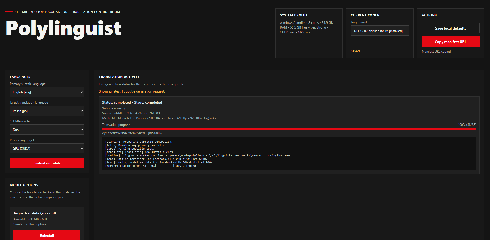
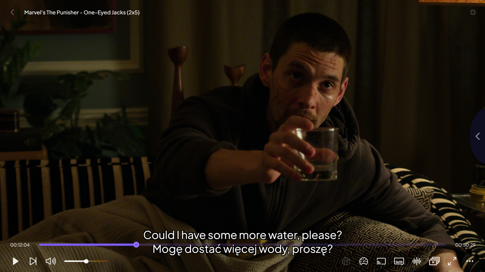

# Polylinguist

<table>
  <tr>
    <td width="48%">
      
    </td>
    <td width="4%"></td>
    <td width="48%">
      
    </td>
  </tr>
</table>

Polylinguist is a local Stremio subtitle addon. It runs as a FastAPI sidecar,
finds a source subtitle, translates it with a user-selected local model backend,
and serves translated or dual subtitles back to Stremio with the original cue
timing preserved.

The current release supports:

- desktop localhost use
- native-host home-server deployment for other Stremio devices
- MarianMT on `cpu`, `cuda`, `directml`, and `openvino_gpu`
- NLLB on `cpu` and `cuda`
- Argos Translate on `cpu`

## What it does

- exposes a Stremio subtitle addon manifest
- lets you choose source language, target language, model, and processing target
- installs translation runtimes and model artifacts locally
- fetches source subtitles from the OpenSubtitles Stremio subtitle endpoint
- generates translated or dual subtitles with shared timestamps
- shows live install and subtitle generation activity in the configurator

## Current limitations

- it does not translate embedded subtitles directly from the Stremio player
- it does not translate an already-selected subtitle track from inside the player
- source subtitle discovery is currently built around the OpenSubtitles Stremio endpoint
- Marian is the only first-pass backend for `directml` and `openvino_gpu`
- NLLB remains `cpu`/`cuda` only in this release

## Requirements

- Python 3.11 or newer
- desktop Stremio client
- Windows is the most tested target so far

Optional:

- NVIDIA GPU for `cuda`
- Windows AMD GPU for `directml`
- Intel Arc GPU for `openvino_gpu`
- extra free disk space for model downloads and subtitle cache

## Install

Create a virtual environment and install the app:

```powershell
python -m venv .venv
.venv\Scripts\Activate.ps1
python -m pip install -e .[dev]
```

If you want to preinstall the common CPU/CUDA runtimes up front instead of
letting Polylinguist bootstrap them on demand:

```powershell
python -m pip install -e .[models,system]
```

If you want to preinstall the Windows DirectML/OpenVINO runtimes as well:

```powershell
python -m pip install -e .[models,windows-gpu,system]
```

Notes:

- Polylinguist can reuse an existing Python runtime on your machine if it
  already has the needed packages installed.
- Missing packages can also be installed on demand from the configurator.
- `windows-gpu` is intended for Windows hosts that want `directml` or
  `openvino_gpu`.

## Run

The most reliable way to start the service is:

```powershell
python -m polylinguist
```

By default that starts the addon locally on:

- `http://127.0.0.1:8000/configure`

If port `8000` is already busy, Polylinguist will automatically move to the
next free port and print the final URL.

If you prefer the console script form, this also works after installation when
your Python `Scripts` directory is on `PATH`:

```powershell
polylinguist
```

For development with explicit uvicorn control:

```powershell
uvicorn polylinguist.app:create_app --factory --host 127.0.0.1 --port 8000 --reload
```

## First-time setup

1. Open the printed `/configure` URL.
2. Choose:
   - primary subtitle language
   - target translation language
   - subtitle mode
   - processing target: `auto`, `cpu`, `cuda`, `directml`, or `openvino_gpu`
3. Click `Evaluate models` for a cache-first/local view of model support.
4. Click `Refresh availability` when you want Polylinguist to refresh online
   Hugging Face and Argos metadata.
5. Install the model backend you want to use.
6. Click `Copy manifest URL`.
7. Add that manifest URL to Stremio as an addon.

The configurator now shows:

- detected accelerators and supported processing targets
- model-supported targets per language pair
- target-specific install buttons
- target-specific remove buttons for installed models
- live model install logs
- live subtitle translation progress

`Evaluate models` now stays local/cache-first so the configurator remains usable
even when Hugging Face or the Argos index are temporarily unavailable.
Use `Refresh availability` when you want an explicit online metadata refresh.

## Using it in Stremio

1. Start playback for a movie or episode.
2. Open the subtitle picker.
3. Choose one of the Polylinguist subtitle entries.
4. If the subtitle is still being generated, Stremio may temporarily show a
   status subtitle telling you where to check progress.
5. Watch `Translation Activity` in the configurator until the job is completed.
6. Re-select the Polylinguist subtitle if Stremio does not automatically refresh.

## Native-host home server mode

Polylinguist can run on a home desktop or server and serve subtitles to another
Stremio device, as long as the addon is reachable over HTTPS.

Important Stremio rule:

- non-`127.0.0.1` addon URLs must use HTTPS

Environment variables:

```powershell
$env:POLYLINGUIST_BIND_HOST = "0.0.0.0"
$env:POLYLINGUIST_BIND_PORT = "8000"
$env:POLYLINGUIST_PUBLIC_BASE_URL = "https://subs.example.net"
$env:POLYLINGUIST_ADMIN_TOKEN = "replace-with-a-secret"
python -m polylinguist
```

Behavior in this mode:

- manifest and subtitle URLs use `POLYLINGUIST_PUBLIC_BASE_URL`
- public routes stay open for Stremio clients
- settings, install actions, and diagnostics APIs require
  `X-Polylinguist-Admin-Token`
- the configurator prompts once for the admin token and keeps it in browser
  session storage

### Runtime diagnostics

The admin API now exposes a runtime diagnostics report:

- `GET /api/diagnostics/runtime`

It returns the detected machine profile plus the selected Python runtime,
package versions, and blocking reasons for each provider/target combination.
On Windows, this report now reflects worker-runtime selection too, so a
Python 3.14 service can still point Marian OpenVINO at a discovered Python 3.13
worker runtime when one is available.

### Caddy reverse proxy helper

Polylinguist includes a helper that prints a ready-to-use Caddy site block:

```powershell
python scripts\print_caddy_config.py --public-base-url https://subs.example.net
```

Example output:

```caddyfile
subs.example.net {
    encode zstd gzip
    reverse_proxy http://127.0.0.1:8000
}
```

## Model backends

### Argos Translate

- `cpu` only
- smallest install footprint
- good low-end or offline default

### MarianMT / OPUS-MT

- default path for many common language pairs
- supports `cpu`
- supports `cuda` when available
- supports `directml` on supported Windows AMD hosts
- supports `openvino_gpu` on supported Intel Arc hosts

### NLLB-200 distilled 600M

- larger multilingual fallback
- supports `cpu`
- supports `cuda`
- does not currently support `directml` or `openvino_gpu`

## Benchmark snapshot

Benchmarks were run on:

- sample file: TV episode subtitle file
- workload: `585` subtitle cues, `19,505` subtitle characters
- GPU: `NVIDIA GeForce GTX 1660 Ti` with `6 GB` VRAM

Measured results on the current development machine:

| Backend | Model | Device | Translation time | Throughput | Notes |
| --- | --- | --- | ---: | ---: | --- |
| Argos Translate | `argos:en-pl` | CPU | `111.14s` | `5.264 cues/s` | Fastest CPU result in this environment |
| MarianMT | `Helsinki-NLP/opus-mt-en-ine` | CPU | `177.148s` | `3.302 cues/s` | Used Polish target token `>>pol<<` |
| MarianMT | `Helsinki-NLP/opus-mt-en-ine` | CUDA | `41.298s` | `14.165 cues/s` | Peak GPU allocation about `386 MB` |
| NLLB-200 distilled 600M | `facebook/nllb-200-distilled-600M` | CUDA | `39.401s` | `14.847 cues/s` | Stable after reboot with `fp16`, `batch_size=32`, `low_cpu_mem_usage`; peak GPU allocation about `1356.6 MB` |

DirectML and OpenVINO benchmark support is now wired into the benchmark runner,
but this repo does not yet include committed measured results from dedicated AMD
or Intel Arc hardware.

The benchmark runner lives in
[`scripts/benchmark_translation.py`](scripts/benchmark_translation.py).
It now uses the same subtitle sanitation step as the live translation pipeline
and prefers installed Marian DirectML/OpenVINO artifacts when they already
exist under Polylinguist's local model directory.

Example commands:

```powershell
.benchmarks\venv\Scripts\python.exe scripts\benchmark_translation.py `
  --subtitle "C:\Users\wdob\Downloads\Marvel's.The.Punisher.S02E05.720p.WEB.x264-STRiFE.srt" `
  --provider marian `
  --device directml `
  --source-lang eng `
  --target-lang pol `
  --model-id Helsinki-NLP/opus-mt-en-ine
```

```powershell
.benchmarks\venv\Scripts\python.exe scripts\benchmark_translation.py `
  --subtitle "C:\Users\wdob\Downloads\Marvel's.The.Punisher.S02E05.720p.WEB.x264-STRiFE.srt" `
  --provider marian `
  --device openvino_gpu `
  --source-lang eng `
  --target-lang pol `
  --model-id Helsinki-NLP/opus-mt-en-ine
```

## Development

Run the test suite:

```powershell
python -m pytest -q
```

Useful local paths:

- app state: `%USERPROFILE%\.polylinguist`
- generated subtitle cache: `%USERPROFILE%\.polylinguist\cache\subtitles`
- model artifacts: `%USERPROFILE%\.polylinguist\models`

You can override the default state directory with:

```powershell
$env:POLYLINGUIST_HOME = "C:\path\to\polylinguist-data"
```

If you want Polylinguist to prefer a specific existing Python interpreter for
model work:

```powershell
$env:POLYLINGUIST_PYTHON = "C:\Path\To\python.exe"
```

## Cleanup and uninstall

To remove a specific installed model target from Polylinguist, use the
`Remove ...` button in the configurator's `Model Options` section.

To remove Polylinguist local settings, cache, and Polylinguist-managed model
artifacts from the terminal:

```powershell
python -m polylinguist.uninstall
```

Or, after reinstalling the package entrypoints:

```powershell
polylinguist-uninstall
```

To skip the confirmation prompt:

```powershell
python -m polylinguist.uninstall --yes
```

Notes:

- shared Hugging Face and Argos caches are left in place
- the uninstall command resets Polylinguist's local data, but it does not
  uninstall the Python package or executable itself
